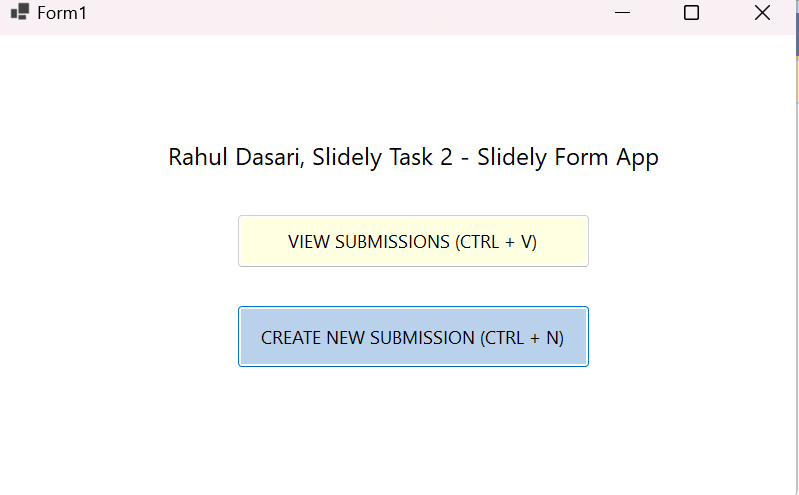
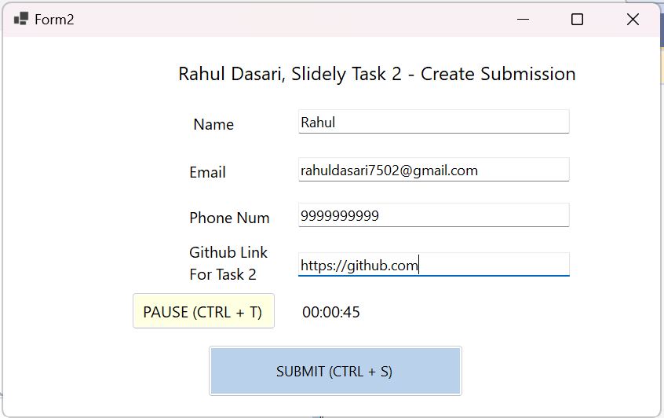
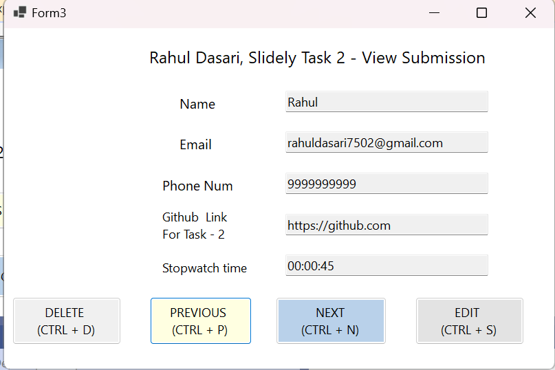

# DesktopSubmissionManager

## Overview
DesktopSubmissionManager is a desktop application developed using VB.NET for creating and viewing submission forms. The application allows users to submit their details and view previous submissions. It also includes features like a stopwatch timer and the ability to edit and delete submissions.

## Features
- **Create Submissions**: Fill out and submit a form with personal details.
- **View Submissions**: View previously submitted forms.
- **Edit Submissions**: Edit existing submissions.
- **Delete Submissions**: Remove submissions.
- **Stopwatch**: Track time elapsed while filling out the form.





## Prerequisites
- Ensure that the backend server is up and running. Follow the instructions below to set up and start the server.

## Installation

### Backend Server Setup

1. **Clone the Backend Server Repository:**
    ```sh
    git clone https://github.com/your-username/SubmissionBackendServer.git
    ```
2. **Install Dependencies:**
    ```sh
    cd SubmissionBackendServer
    npm install
    ```
3. **Start the Server:**
    ```sh
    npm start
    ```
    The server will start on `http://localhost:3000`.

### Desktop Application Setup

1. **Clone the Desktop Application Repository:**
    ```sh
    git clone https://github.com/your-username/DesktopSubmissionManager.git
    ```
2. **Open the Project:**
    - Open the project in Visual Studio.
3. **Restore NuGet Packages:**
    - Right-click on the solution and select `Restore NuGet Packages`.
4. **Build the Solution:**
    - Build the solution by pressing `Ctrl+Shift+B` or by selecting `Build Solution` from the `Build` menu.

## Usage

1. **Run the Backend Server:**
    - Ensure the backend server is running by following the steps in the Backend Server Setup section.

2. **Run the Desktop Application:**
    - Press `F5` or click on the `Start` button to run the application.

3. **Create Submission:**
    - Click on the `Create Submission` button, fill out the form, and click `Submit`.

4. **View Submissions:**
    - Click on the `View Submissions` button to view all past submissions.

5. **Edit Submissions:**
    - While viewing submissions, click the `Edit` button to make changes. The button will change to `Save`. After editing, click `Save` to update the submission.

6. **Delete Submissions:**
    - Use the provided delete functionality to remove unwanted submissions.

## Keyboard Shortcuts
- **Ctrl+S**: Submit the form.

## Contributing
1. Fork the repository.
2. Create a new branch (`git checkout -b feature-branch`).
3. Make your changes.
4. Commit your changes (`git commit -m 'Add new feature'`).
5. Push to the branch (`git push origin feature-branch`).
6. Create a new Pull Request.

## License
This project is licensed under the MIT License - see the LICENSE file for details.

## Contact
For any queries, please contact [your-email@example.com].
